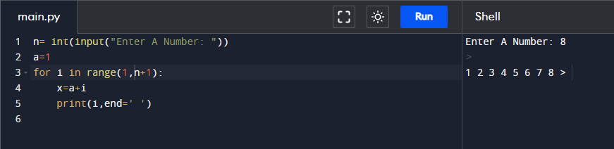
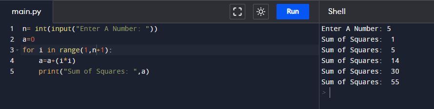
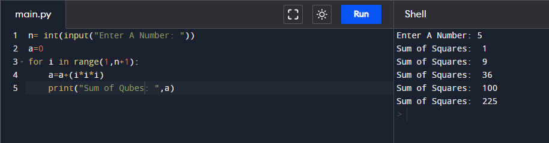
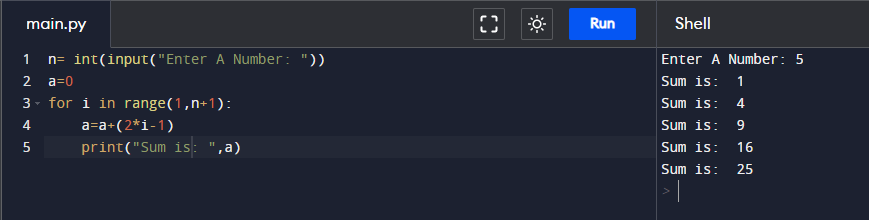
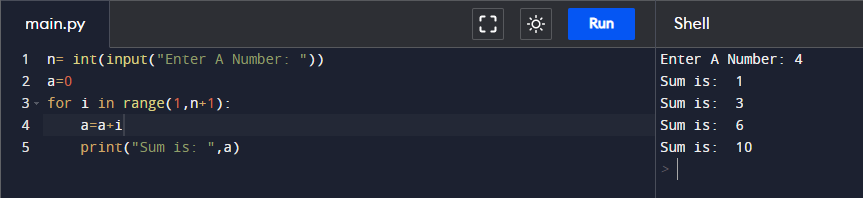
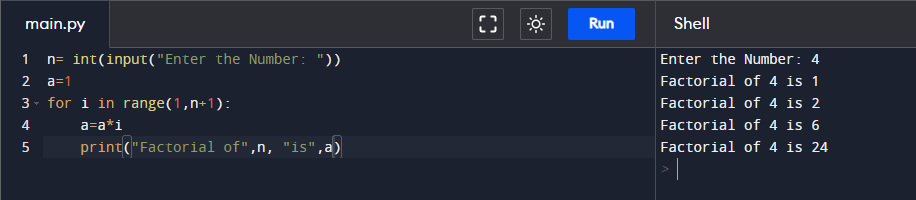
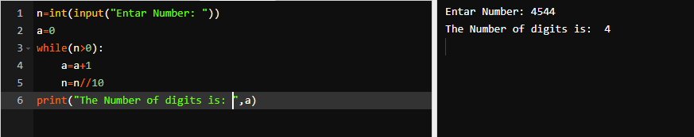
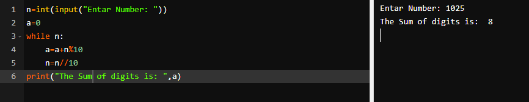
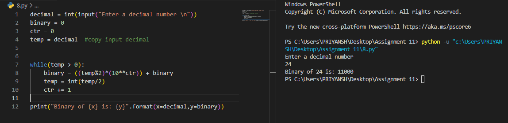
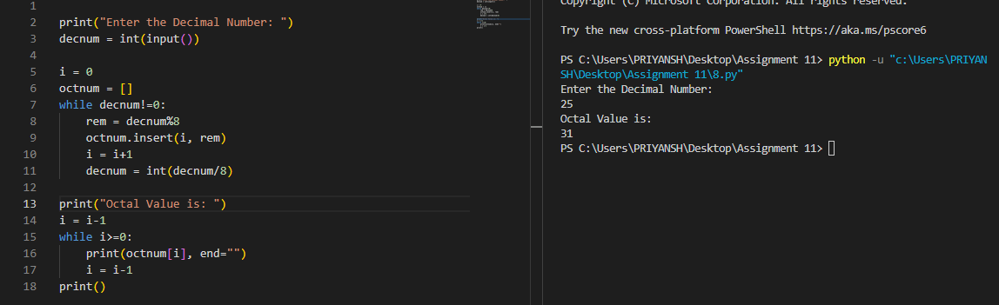

# Assignment - 11 Full Stack Web Development using Python MySirG loops

    Qns 1. Write a python script to calculate sum of first N natural numbers.

    Ans.

    Qns 2. Write a python script to calculate sum of squares of first N natural numbers.

    Ans.

    Qns 3. Write a python script to calculate sum of cubes of first N natural numbers.

    Ans.

    Qns 4. Write a python script to calculate sum of first N odd natural numbers.

    Ans.

    Qns 5. Write a python script to calculate sum of first N even natural numbers.

    Ans.

    Qns 6. Write a python script to calculate factorial of a given number.

    Ans.

    Qns 7. Write a python script to count digits in a given number.

    Ans.

    Qns 8. Write a python script to calculate sum of digits of a given number.

    Ans.

    Qns 9. Write a python script to print binary equivalent of a given decimal number. (do not use bin() method).

    Ans.

    Qns 10. Write a python script to print the octal equivalent of a given decimal number. (do not use oct() method).

    Ans.
